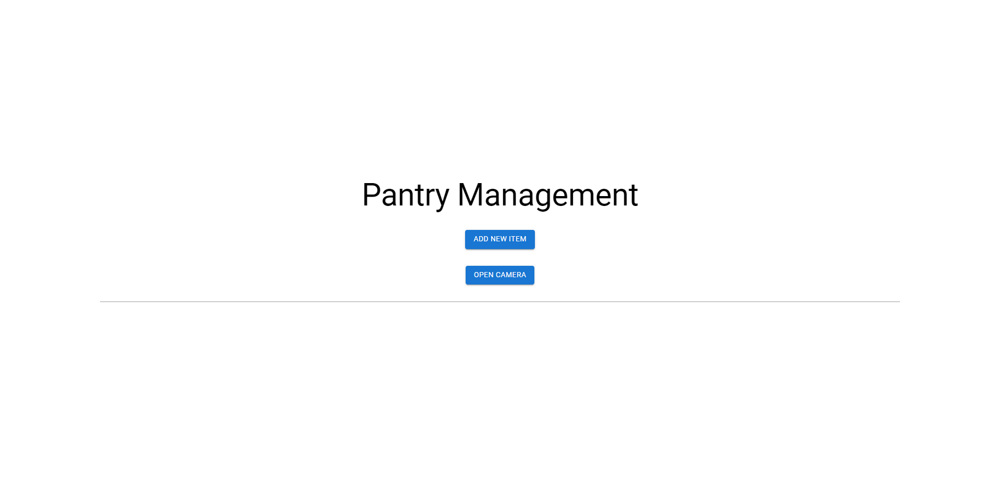

# Inventory Management App

An Inventory Management App built with Next.js, React, Firebase, and Material-UI. This application allows users to manage inventory items, including adding, removing, and updating item quantities. It also includes a feature to access the device's camera.

  

## Features

- **Add New Items:** Users can add new items to the inventory.
- **Update Quantities:** Users can increase or decrease the quantity of items.
- **Delete Items:** Users can remove items from the inventory.
- **Camera Access:** Users can access their device's camera.

## Technologies Used

- **Frontend:**
  - [Next.js](https://nextjs.org/)
  - [React](https://reactjs.org/)
  - [Material-UI](https://mui.com/)

- **Backend:**
  - [Firebase Firestore](https://firebase.google.com/docs/firestore)

## Getting Started

### Prerequisites

- [Node.js](https://nodejs.org/) (version 14 or higher)
- [npm](https://www.npmjs.com/) or [Yarn](https://yarnpkg.com/)

### Installation

1. **Clone the repository:**
   ```bash
   git clone https://github.com/your-username/inventory-management-app.git
   cd inventory-management-app
    ```
2. **Install dependencies:**
    ```bash
    npm install
    # or
    yarn install
    ```
3. **Firebase Setup:**

    -Go to the Firebase Console.
    -Create a new Firebase project.
    -Add a new web app to your project.
    -Copy the Firebase configuration and replace it in the firebase.js file. 
    ```javascript
    // firebase.js
    import { initializeApp } from "firebase/app";
    import { getFirestore } from "firebase/firestore";

    const firebaseConfig = {
        apiKey: "your-api-key",
        authDomain: "your-auth-domain",
        projectId: "your-project-id",
        storageBucket: "your-storage-bucket",
        messagingSenderId: "your-messaging-sender-id",
        appId: "your-app-id",
        measurementId: "your-measurement-id",
    };

    const app = initializeApp(firebaseConfig);
    const firestore = getFirestore(app);

    export { firestore };
    ```
4. **Run the development server:**
    ```bash
    npm run dev
    # or
    yarn dev
    ```
    Open http://localhost:3000 with your browser to see the app in action.

## Usage
1. **Add Item:** Click on "Add New Item" to open the modal and add an item to the inventory.
2. **Update Quantity:** Use the "Add" button to increase the quantity and the "Remove" button to     decrease the quantity of an item.
3. **Camera Access:** Click on "Open Camera" to access the device's camera. The button will change to "Close Camera" while the camera is active.    
    
## Project Structure
-components/: Contains reusable React components.
-pages/: Contains the main pages of the app, managed by Next.js.
-firebase.js: Firebase configuration and initialization.
## License
 This project is licensed under the MIT License. See the LICENSE file for details.

## Contact

For any questions, feedback, or issues related to this project, you can reach out to me using the following methods:

- **Email:** [hasanulbannahimel2003@gmail.com](mailto:hasanulbannahimel2003@gmail.com)
- **GitHub:** [Hasanul-Banna-Himel](https://github.com/Hasanul-Banna-Himel)


Feel free to open an issue on the [GitHub repository](https://github.com/Hasanul-Banna-Himel/pantry-tracker/issues) if you encounter any problems or have any questions about the project.


